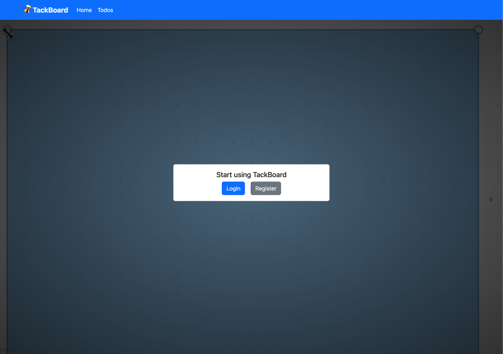
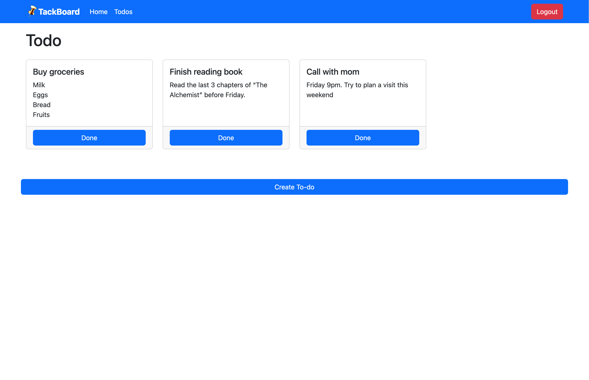
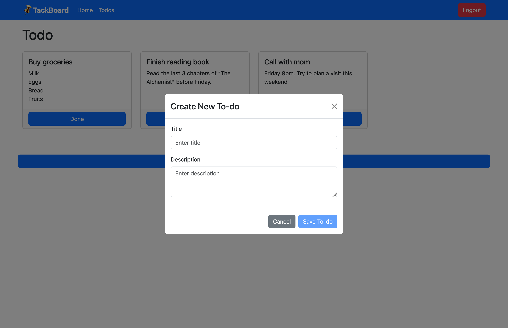
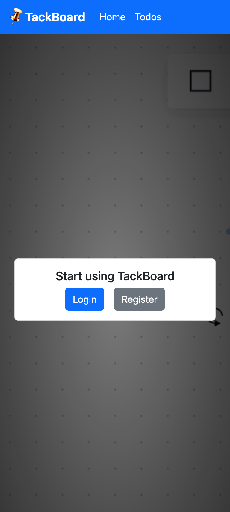
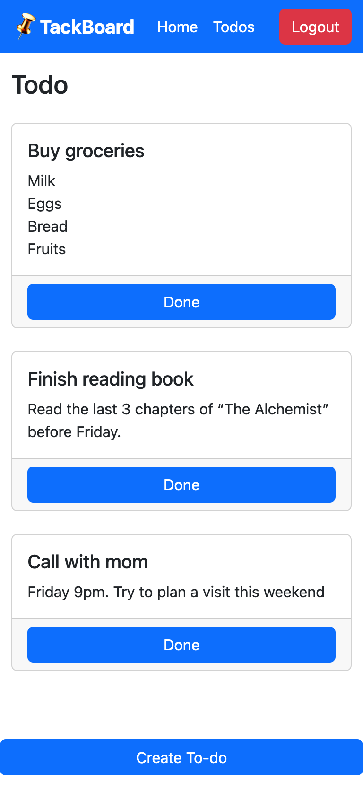
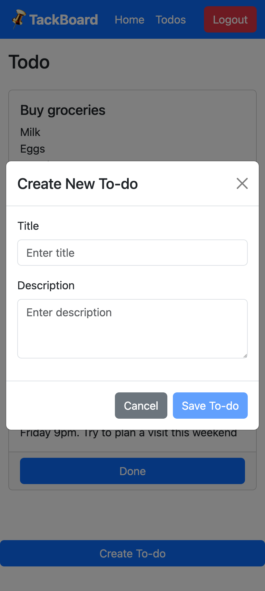

# Tackboard
A React To-do app powered by Java Springboot & PostgreSQL.  
Made responsive with Bootstrap.

## Desktop

### Login Page


### Todos Page


### Creating Todo Page


## Mobile

### Login Page


### Todo Page


### Creating Todo Page



## Clone this directory:
```
git clone --recurse-submodules https://github.com/KaviV23/tackboard
```
